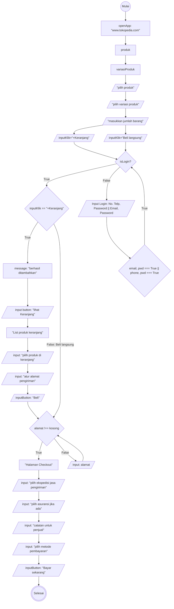

# Algoritma Checkout Tokopedia

# Algoritma Deskriptif
1. Mulai
2. Buka website tokopedia.com
3. Cari dan Pilih produk yang akan dibeli
4. Pilih variasi produk (warna, ukuran, dll)
5. Masukkan Jumlah Barang
6. Klik tombol +Keranjang atau Beli Langsung
7. Jika belum login, maka login terlebih dahulu atau jika belum daftar, daftar terlebih dahulu.
8. Jika Tekan +Keranjang maka akan muncul pesan "Berhasil di Tambahkan" dan Tombol "Lihat Keranjang". Namun jika klik tombol "beli langsung", maka akan langsung diarahkan ke halaman Checkout (langkah ke 13).
9. Klik Lihat Keranjang, maka akan diarahkan ke keranjang
10. Ceklis produk di keranjang yang ingin dicheckout
11. Atur alamat pengiriman
12. Klik tombol "Beli" maka akan diarahkan ke halaman checkout.
13. Jika alamat belum di atur, maka tidak langsung ke halaman checkout, akan muncul pesan "Ongkir gagal ditampilkan". Atur alamat pengiriman
14. Jika sudah masuk ke halaman checkout, pilih ekspedisi jasa pengiriman
15. Pilih asuransi jika ada
16. Berikan catatan tambahan untuk penjual
17. Pilih metode pembayaran
18. Klik tombol "Bayar Sekarang"
19. Selesai

# Algoritma Flowchart
