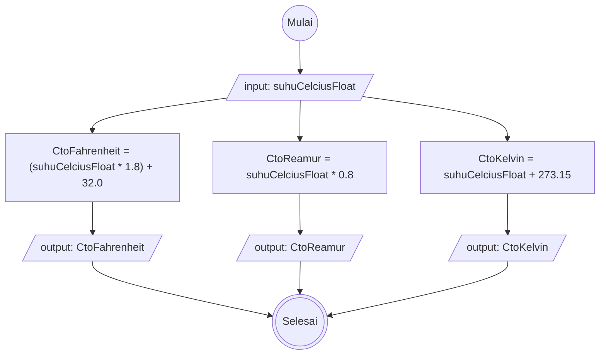

# Algoritma Konversi Suhu
## Deskriptif
1. Mulai
2. Masukkan nilai suhu celcius dengan nilai desimal
3. Konversi suhu celcius ke suhu Fahrenheit dengan mengkalikan suhu celcius dengan 1.8, lalu tambahkan hasilnya dengan 32.0
4. Konversi suhu celcius ke suhu Reamur dengan mengkalikan suhu celcius dengan 0.8
5. Konversi suhu celcius ke suhu Kelvin dengan menambahkan suhu celcius dengan 273.15

## Flowchart
