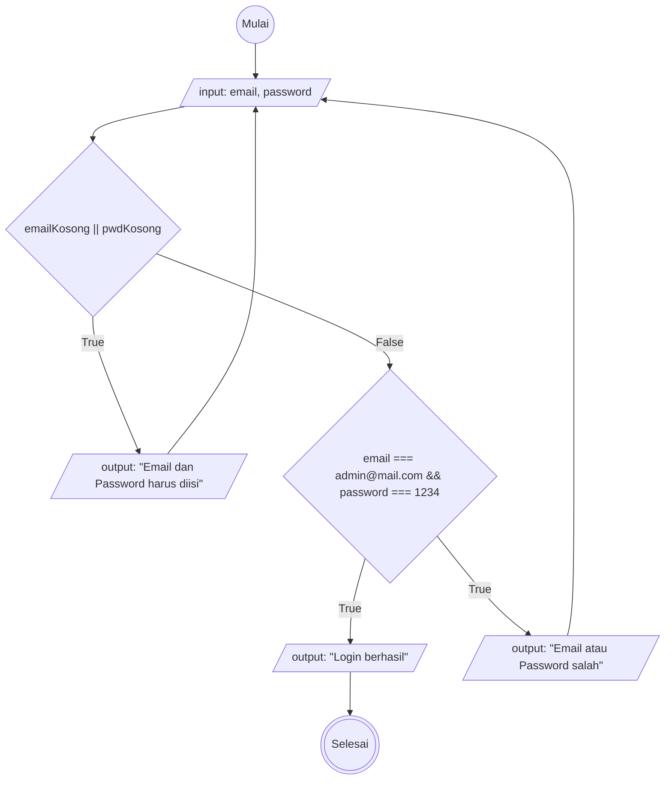

```mermaid
flowchart TD
start@{shape: circle, label: "Mulai"}
input@{ shape: lean-r, label: "input: email, password"}
decisionIsi@{ shape: diamond, label: "emailKosong || pwdKosong" }
outputKosong@{ shape: lean-r, label: 'output: "Email dan Password harus diisi"'}
decisionLogin@{ shape: diamond, label: "email === admin@mail.com && password === 1234" }
outputBerhasil@{ shape: lean-r, label: 'output: "Login berhasil"'}
outputGagal@{ shape: lean-r, label: 'output: "Email atau Password salah"'}
stop@{shape: dbl-circ, label: "Selesai"}

start-->input
input-->decisionIsi
decisionIsi--True-->outputKosong
outputKosong-->input
decisionIsi--False-->decisionLogin
decisionLogin--True-->outputBerhasil
decisionLogin--True-->outputGagal
outputGagal-->input
outputBerhasil-->stop
```