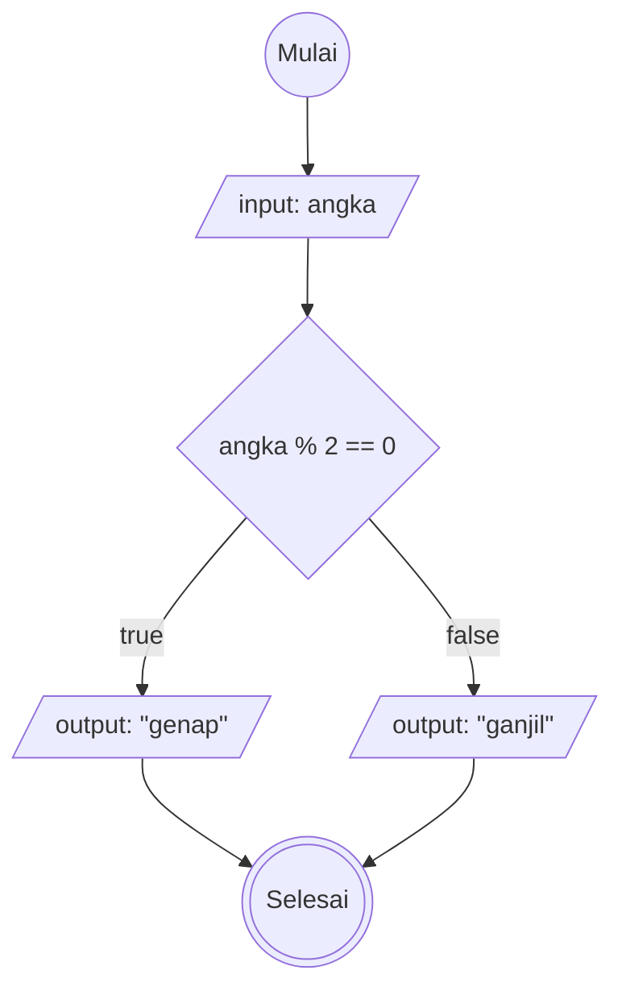

```mermaid
flowchart TD
start@{shape: circle, label: "Mulai"}
stop@{shape: dbl-circ, label: "Selesai"}
input@{ shape: lean-r, label: "input: angka"}
decision@{ shape: diamond, label: "angka % 2 == 0" }
ganjil@{ shape: lean-r, label: 'output: "ganjil"'}
genap@{ shape: lean-r, label: 'output: "genap"'}

 start-->input
 input-->decision
 decision-- true --> genap
 decision-- false --> ganjil
 genap-->stop
 ganjil-->stop

```