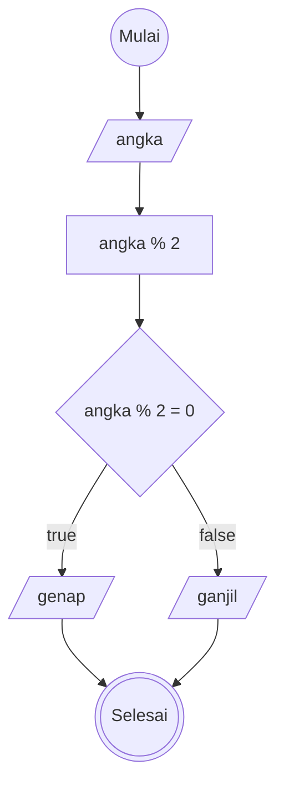

```mermaid
flowchart TD
start@{shape: circle, label: "Mulai"}
stop@{shape: dbl-circ, label: "Selesai"}
input@{ shape: lean-r, label: "angka"}
proses@{ shape: rect, label: "angka % 2" }
decision@{ shape: diamond, label: "angka % 2 = 0" }
ganjil@{ shape: lean-r, label: "ganjil"}
genap@{ shape: lean-r, label: "genap"}

 start-->input
 input-->proses
 proses-->decision
 decision-- true --> genap
 decision-- false --> ganjil
 genap-->stop
 ganjil-->stop

```