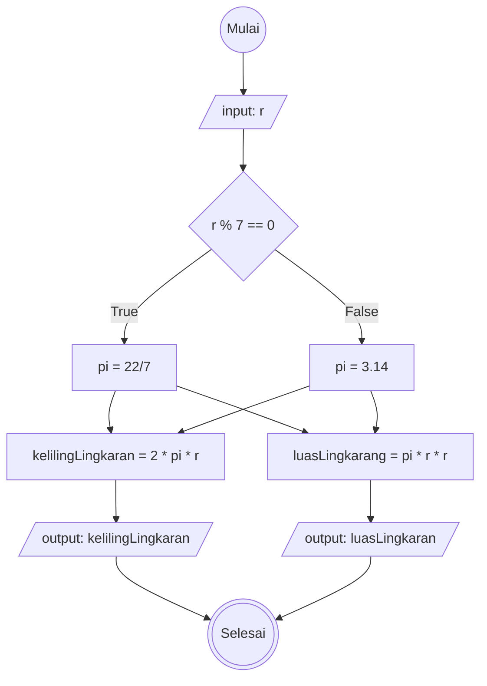

```mermaid
flowchart TD
start@{shape: circle, label: "Mulai"}
inputJari@{ shape: lean-r, label: "input: r"}
decisionPi@{ shape: diamond, label: "r % 7 == 0" }
oPiTrue@{ shape: rect, label: "pi = 22/7"}
oPiFalse@{ shape: rect, label: "pi = 3.14"}
luasLingkaran@{ shape: rect, label: "luasLingkarang = pi * r * r" }
kelilingLingkaran@{ shape: rect, label: "kelilingLingkaran = 2 * pi * r" }
outKeliling@{ shape: lean-r, label: "output: kelilingLingkaran"}
outLuas@{ shape: lean-r, label: "output: luasLingkaran"}
stop@{shape: dbl-circ, label: "Selesai"}

start-->inputJari
inputJari-->decisionPi
decisionPi--True-->oPiTrue
decisionPi--False-->oPiFalse
oPiTrue-->luasLingkaran
oPiTrue-->kelilingLingkaran
kelilingLingkaran-->outKeliling

oPiFalse-->luasLingkaran
oPiFalse-->kelilingLingkaran

outKeliling-->stop
luasLingkaran-->outLuas
outLuas-->stop
```