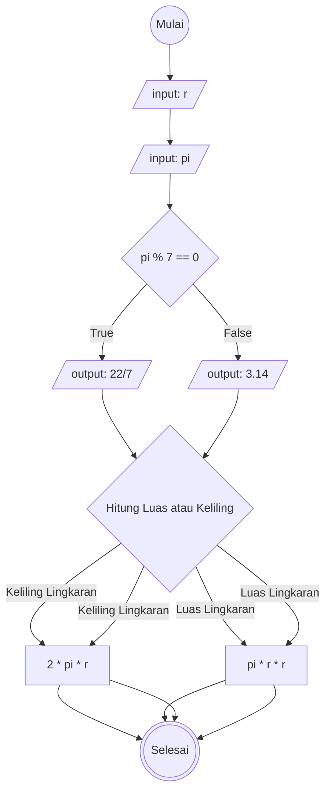

```mermaid
flowchart TD
start@{shape: circle, label: "Mulai"}
inputJari@{ shape: lean-r, label: "input: r"}
inputPi@{ shape: lean-r, label: "input: pi"}
decisionPi@{ shape: diamond, label: "pi % 7 == 0" }
decisionHitung@{ shape: diamond, label: "Hitung Luas atau Keliling" }
oPiTrue@{ shape: lean-r, label: "output: 22/7"}
oPiFalse@{ shape: lean-r, label: "output: 3.14"}
luasLingkaran@{ shape: rect, label: "pi * r * r" }
kelilingLingkaran@{ shape: rect, label: "2 * pi * r" }
stop@{shape: dbl-circ, label: "Selesai"}

start-->inputJari
inputJari-->inputPi
inputPi-->decisionPi
decisionPi--True-->oPiTrue
decisionPi--False-->oPiFalse
oPiTrue-->decisionHitung
decisionHitung--Luas Lingkaran-->luasLingkaran
decisionHitung--Keliling Lingkaran-->kelilingLingkaran
kelilingLingkaran-->stop
luasLingkaran-->stop
oPiFalse-->decisionHitung
decisionHitung--Luas Lingkaran-->luasLingkaran
decisionHitung--Keliling Lingkaran-->kelilingLingkaran
kelilingLingkaran-->stop
luasLingkaran-->stop
```